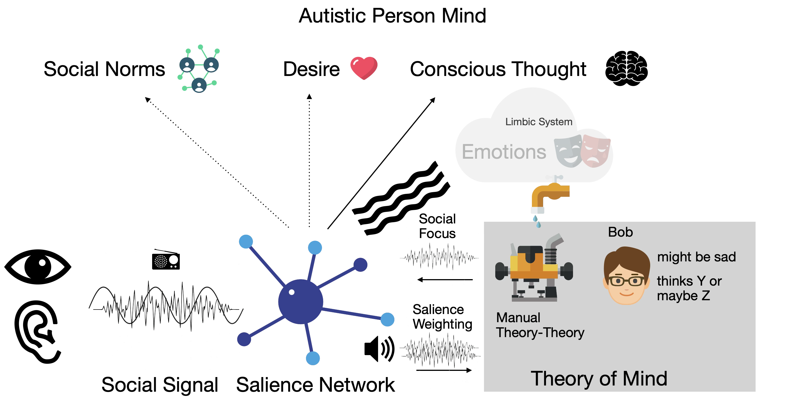

This describes a typical autistic person's experience of [Theory of Mind](Theory%20of%20Mind.md).  Autism varies widely and if you are autistic and reading this it may not match *your* experience.

**Note**: I do not experience this and have only information gleaned from LLMs.  In fact this may not match _anyone's_ experience, but this model _does_ fit with how I have read people think the ToM mechanism behind autism works.  I use this to understand myself, not diagnose others -- I can see my own experience through contrast.

See also: [NT Experience](NT%20Experience.md) and [My Experience](My%20Experience.md).

## How It Works

From what I understand there are two common phenotypes for autism:

- High [Social Salience](Social%20Salience.md) (high signal), high noise -- social signals are seen but can be an overwhelming wall of sound.  A person with this might experience:
	- Sensory overload and meltdowns are possible.
	- High social anxiety as they try to consume this input and make sense of it.
	
- [Hyposalience](Hyposalience.md) (low signal), high social desire -- social signals are unclear or even missing, but there is a sense that they are missing.  A person with this might experience:
	- Straining to pick up the signal that they know is there.
	- Social drive causes them to want to connect and belong.
	- They are aware of being apart -- the social friction.
	- See [John Elder Robison](Where%20Are%20My%20People?.md#^Hyposalience) -- he wrote a book about his experience.

I am primarily describing the first variant, though I believe that the mechanism is similar for both -- it differs in how the signals are disrupted and presented.  This is a structural map for *how*, not a definition of the person.

- The various senses provide the "social signal" to the [salience network](Social%20Salience.md)
	- These are the nonverbal cues that people give off about what they are thinking and feeling
	- And the implicit/subtextual meaning of words -- NT speech often contains hidden or implicit meaning (sarcasm, metaphors, or social white lies)
	- This signal is noisy -- it picks up too much.  It might be like static on the radio or distorted like turning the volume up too loud
- The salience network tries to decode this signal but struggles with the overwhelming input signal
	- In NT people, the salience network would filter out unimportant information and assign importance (salience) to the information
	- For some autistic people it may pass *everything* through as top importance
	- For others (or the same people at different times) it may fail to identify anything as important
	- This feeds the limbic system (emotions) with Social Focus
	- This feeds [Theory of Mind](Theory%20of%20Mind.md) with the Salience Weighting (the decoded signal)
- The limbic system is the emotional core and it causes people to feel emotions that they sense
	- Because the signal from the salience network may be noisy or unfiltered the limbic system may run in a state of hyper-arousal
	- This may trigger high levels of affective [Empathy](../Emotions/Empathy.md) -- picking up and feeling the emotions of those around them
	- Autistic people often experience emotions in a bottom-up rather than top-down fashion
		- A disconnect between the limbic system and conscious thought
		- Emotions may register as raw physiological signals rather than feelings like "I am anxious about this meeting"
		- See also [Alexithymia](Alexithymia.md)
- Theory of Mind is a group of systems in the brain
	- The output of the salience network is unable to trigger the automatic Simulation that NT people experience
	- Instead, autistic people use manual processing, manual simulation
	- Called Theory-theory
	- People must manually process social signals through propositional logic
		- Behavior X implies intent Y
	- Search for meaning, intention, subtext.  Hyper-vigilance
	- Anxiety around misinterpretation
	- Conflicting thoughts about what others think
	- High effort
		- This can lead to *meltdowns*, social fatigue, or being overwhelmed
	- Social lag
		- The effort and processing takes time and reactions may lag
	- Experience the [Double Empathy](Double%20Empathy.md) problem
- For these reasons autistic people *prefer* literal signal
	- But they live in and participate in an NT world and have to expend considerable effort trying to fit in
	- [Masking](Masking.md)

## How It Feels

I am projecting based on what I have read.  This may sound a bit stilted -- I don't experience this and I am trying to contrast it to how NT people and myself experience the world.

Autistic people are widely varied.  There is a saying: "if you have met one person with autism, you have met one person with autism".  I suspect that feelings and experiences vary widely, probably much more so than for NT people.  I am aiming for a middle of the road description here -- it may not match any one person, but hopefully is near several.

Autistic people feel many of the same social connections that NT people feel. Their minds are built for social interaction. They feel a strong sense of justice and fairness in society. They prefer to communicate literally and may [Say The Wrong Thing](Say%20The%20Wrong%20Thing.md) (from the NT point of view) -- they can be extremely honest and might be judged as blunt. [Double Empathy](Double%20Empathy.md) is a term that describes this mismatch in communication styles.  NT people fail to model the autistic mind properly and mis-predict or wrongly attribute intent.  Autistic people might use [Masking](Masking.md) to try and fit in, but this is effortful and not always effective.

When talking to other literal minded people, communication can be clear and efficient.

Many autistic people are extremely tuned in to the vibe of the room -- they can be hyper-aware of social signals.  However, unlike NT people who automatically decode these signals for [Theory of Mind](Theory%20of%20Mind.md), autistic people have to manually decode using a mechanism called Theory-Theory.  This is high effort, takes time, and may produce a noisy signal.  This may lead to social fatigue and meltdowns.
