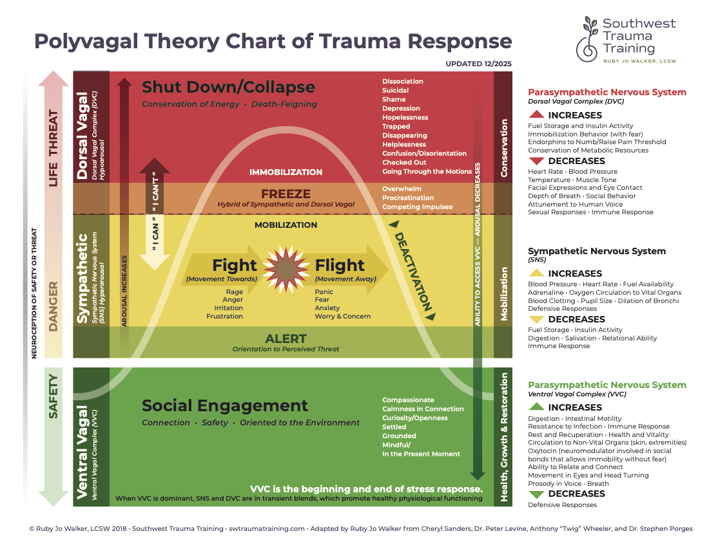

Mitigate what?  I didn't even realize [there was anything wrong](Everybody%20is%20the%20Same.md).

- I don't experience any [Friction](Friction.md) myself
- I work as a software developer and my [Functional Cognitive Architecture](../Cognition/Functional%20Cognitive%20Architecture.md) fits like a glove
	- my no [Ego](../Emotions/Ego.md) approach makes me easy to work with
- with friends and neighbors I might appear a bit odd
	- but once people are used to me, normal enough

With my children I am reliable but probably emotionally absent:

- [Flat Affect](Flat%20Affect.md)
- no [Empathy](../Emotions/Empathy.md)

With my wife it is a different story entirely -- this is the closest relationship and my lack of [Social Salience](Social%20Salience.md) causes some *communication difficulties*.  Let's see how.
## Polyvagal Theory

Polyvagal theory, developed by Dr. Stephen Porges, explains how the autonomic nervous system perceives safety or danger and responds through a hierarchical three-part system: ventral vagal (calm/social), sympathetic (fight/flight), and dorsal vagal (shutdown).  [Here is a nice article about it](https://www.swtraumatraining.com/polyvagal-theory) with some charts (one reproduced below).

My therapist showed me this chart to help explain how others behave and perhaps to elicit response from me.  I realized I normally live in the green zone, rarely get into the yellow zone and perhaps have never been in the red zone.  My wife was sometimes pushed into the red zone and was unable to response, meanwhile I am still carrying on a conversation from the green zone.  A recipe for trouble!

**Note**: technically I am probably not in any zone -- these is a social/emotional model.  I am not participating in the social zone.  Even my yellow/red zone experience would be tempered by the fact that I don't experience these [Emotions](../Emotions/Emotions.md) the same way NT people do.  My emotions tend to run much colder and are more labels of state.  That is not to say that I don't experience any of this, but it is likely very different.

NT people are able to pick up vibes and sense where people are in this chart.  As people leave the green zone and enter the yellow they immediately know.  My understanding is that they can tell even without talking!  They use empathy and co-regulation to deescalate the tension -- social harmony is a key factor in NT relationships.

For me, not so much.  My lack of [Social Salience](Social%20Salience.md) means I can't pick up the vibes when we leave the green zone.  I have no affective [Empathy](../Emotions/Empathy.md).  Indeed, my behavior likely escalates the tension:

- I don't know how they feel, I don't mirror the emotion
- my [Flat Affect](Flat%20Affect.md) signals lack of care and even aggression
- my calmness as their tension rises fans the flames
- my literal processing and strict [logic](../Cognition/Functional%20Logic%20Modeling.md) are not helpful when emotions are high
- apparently asking "why?" doesn't help either
	- there is a term for this, [sealioning](https://en.wikipedia.org/wiki/Sealioning), and it is a form of harassment (yikes!)

Typically I know that there is something wrong when yelling starts.  It is like saying ["I am angry"](../Emotions/Anger.md#Comparison) from my point of view.  This is typically in the red zone.

The problem between my wife and me isn't a simple communication issue: we are not failing to communicate clearly, we are having different conversations.
## What Can I Do?

Lucky for me I need to improve communication with only one person: my wife.  Can I manually override my behavior in some cases?  Can I detect when to do so?

LLM feedback: Signal-Blindness is an input deficit, not a processing error. Mitigation strategies must focus on **External Telemetry** (data provided by others) rather than **Internal Intuition** (which does not exist in the stack).

Here are some ideas:

- detection
	- if I can detect when things are not as they seem I can take action
		- ask questions
		- disengage until later
		- I am not sure I can perform calming/deescalation
	- non sequiturs, e.g. [this example](../Cognition/Examples.md#Failure%20Example), are a sure sign I don't understand
	- yelling = red zone
	- can I detect entry into the yellow zone?  there is still time there
		- volume and pitch of voice
- become an active data requester
	- when I notice missing data, ask
	- if I think my understanding is incomplete or wrong, ask
	- maybe: poll for thoughts actively
	- how to ask for missing information
		- e.g. I think you may be feeling angry, please explain
		- Can you tell me what you are feeling?
		- Can you explain X to me?  Here is what I understand …
		- I understand the situation. Do you want me to help find a solution, or do you just need me to listen?
- when my wife is in the red zone, don't keep pushing
	- LLM suggested script: I am detecting high volume/pitch. I am assuming high distress. I am entering listen-only mode.
- feedback / speech patterns
	- understand NT people react negatively to being judged, criticized (even if constructive), or even receiving honest feedback
	- true even when asked for outside of certain cases like reviewing writing or asking for “brutal honesty”
	- make sure to review the “item” not the person.  Bad: you need to add more salt.  Good: the salt level in this is too low.
		- This is PR feedback language
	- err on the side of not giving feedback in most cases.  Some kind of affirmation is desired, not improvement
	- keep judgment to myself typically

## What Can My Wife Do?

My wife likely knows better than I do when things are getting off the rails.  Can she communicate that explicitly?  Will I understand?  This isn't typical NT behavior, so just like for me this requires manual override.

- expect
	- I cannot simply think or perceive differently
	- not a matter of practice or effort
	- my expression will still be on the flat side
	- I am limited in some ways that will be surprising or don’t make sense to you
- be radically explicit
	- you will not hurt my feelings by explaining
	- I have no shame response
- can you indicate when tensions are rising?
## Statement of Intent

All I can do is try -- I cannot promise positive results.  I can continue to identify cases where I can do better.  Here is what I think:

- I am accountable for my conduct. I am not responsible for the social subtext others project onto me
- Although I cannot directly perceive NT trigger states and don’t have the capability to feel them, I do understand that they cause friction, bad feelings and stress
- Your distress is a fact of your system; my lack of distress is a fact of mine. I accept your distress as a real data point without requiring it to overwrite my own logical state.
	- Both of our experiences are real and true to us and do not invalidate the other
	- Even though the NT experience is most common, it is no more valid than my own experience
- I will continue to make mistakes here.  I have no ill intent and have functional deficits that make preventing errors impossible – but I will make an effort
	- I am accountable for my actions. If my conduct causes harm, I am the causal agent of that harm, regardless of my intent
	- I do not feel [Guilt](../Emotions/Guilt.md) or [Shame](../Emotions/Shame.md) -- I lack the hardware for it.  I do experience logical [Regret](../Emotions/Regret.md): the recognition that a rule was broken and the output was suboptimal. I will not shy away from acknowledging my role in an error
	- because this is a low level function gap, my manual overrides will never be completely reliable or effective.  I will continue to fail but I hope I can get better
	- I have no affective [Empathy](../Emotions/Empathy.md) and my [Comforting](../Emotions/Comforting.md) techniques are useless.  I don't know what to do, but I am open to explicit instructions on what actions (e.g., physical space, specific tasks, verbal confirmation) will help restore the system to a stable state
- I appreciate critical feedback on my performance
	- I don’t feel shame about this and honest feedback, even if it sounds harsh is more valuable than affirmation or silence
	- It is fine to identify when an incident occurs (even after the fact), I can ask questions
