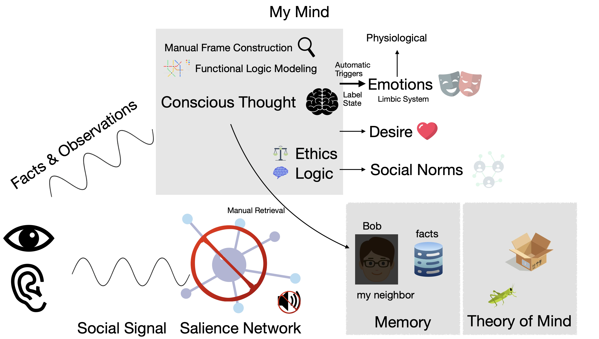

You can read my [History](History.md) and how I discovered that I was ND after over 50 years thinking [Everybody is the Same](Everybody%20is%20the%20Same.md).

I have identified two root causes for my ND condition:

- no [Social Salience](Social%20Salience.md) / [Pure A-salience](Pure%20A-salience.md) -- no social signal, don't care about social status
- [Hypophantasia](Hypophantasia.md) -- low imagery manual

everything else falls out of that, perhaps the important pieces being:

- no [Theory of Mind](Theory%20of%20Mind.md)
- [Semantic Divergence](../Emotions/Semantic%20Divergence.md) in emotions
## How It Works

{: style="max-width: 700px"}

- The various senses provide the "social signal" to the salience network
	- As far as I can tell, my senses are OK
	- I can notice nonverbal cues of a high enough magnitude: crying, exaggerated facial expressions, laughing, yelling
- My [salience network](Social%20Salience.md) produces no output
	- The salience network would provide signal to other systems with importance (salience) information -- mine doesn't
	- It doesn't feed into the limbic system (emotions) -- I have no affective [Empathy](../Emotions/Empathy.md)
		- I am prosocial
		- Have strong [Ethics](../Cognition/Ethics.md)
		- Employ [Narrative Affective Resonance](../Emotions/Empathy.md#Narrative%20Affective%20Resonance) to understand emotional situations)
	- It doesn't feed [Theory of Mind](Theory%20of%20Mind.md) -- I have no theory of mind
	- I believe that it is either disabled or muted rather than just disconnected because other signals pass through here to provide the salience information for social interaction -- I have none
	- [Failure Example](../Cognition/Examples.md#Failure%20Example) is an example of a failure to assign salience
- Theory of Mind is a group of systems in the brain
	- For most people this answers questions like: what is Bob thinking?  How is Bob feeling?
	- For NT people this is automatic -- they don't have to ask themselves these questions, they *know it*
	- My theory of mind is empty or deactivated, see more details in [Theory of Mind](Theory%20of%20Mind.md#My%20Experience%20Summary)
	- Mentally I model people as [Black Boxes](Black%20Box.md) -- I can observe inputs and outputs but I don't know internal state or mechanisms
- Normally, lack of Theory of Mind might make it hard to fit in to society
	- I have an alternate "operating system"
	- For most interactions, I don't even attempt to understand what people are thinking -- [Zero Lag](../Cognition/Zero%20Lag.md)
	- For other interactions I use [Manual Frame Construction](../Cognition/Manual%20Frame%20Construction.md) and [Functional Logic Modeling](../Cognition/Functional%20Logic%20Modeling.md) to build a logical model
		- I can predict something like: if I want output Y then I need to supply input X
		- This is very effortful and not often used -- think about it like the prep work you might employ for a meeting with the CEO
	- For people I know well, I have prebuilt logical models and I can employ coarse grained generic models for random people
	- People are not represented in Theory of Mind, rather in my memory
		- They have attached metadata
		- They are not represented by a persistent simulation as they might be in Theory of Mind
	- This is all processed with conscious thought
	- The prosocial behavior that would come from social norms comes from [Axiomatic Deontology](../Cognition/Ethical%20Systems.md#Axiomatic%20Deontology) and [Ethics](../Cognition/Ethics.md) -- I behave prosocially because I think it is logical and correct to do so
	- This is normally low effort, zero lag, and potentially produces the same sort of interaction issues that autistic people experience: [Say The Wrong Thing](Say%20The%20Wrong%20Thing.md) and [Double Empathy](Double%20Empathy.md)
	- I never attempted [Masking](Masking.md) because I [never noticed I was different](Everybody%20is%20the%20Same.md)
	- However, the part of the brain that might cause anxiety about social interaction is ... the non-functional salience network
		- I have no [Shame](../Emotions/Shame.md) or [Embarrassment](../Emotions/Embarrassment.md)
		- So I have no anxiety about social gaffes
		- But do note that this is asymmetric -- I experience no anxiety but people around me, especially my wife, do
- The salience network would normally flow into the limbic system (emotions)
	- I do have [Emotions](../Emotions/Emotions.md) but my experience is quite different from NT people
	- I don't have [Alexithymia](Alexithymia.md)
	- Emotions are more a label for mental and physiological state
	- Example: I might feel a rush of adrenaline if I am angry.  When the condition for being angry is gone the emotion is also go, though the adrenaline may remain.  I experience this as "twitchy because of adrenaline" but NT people fell "I am still angry because of adrenaline"
	- I am not angry, I am thinking angry thoughts
- Not pictured: the Amygdala (threat center of the brain) can bypass the conscious thoughts
	- I am afraid of heights -- I feel the fear even though I know logically it is irrational

## What Does it Feel Like?

Calm, quiet, peaceful.  I think there is a ton of social stress that is just not visible to me.  Social salience is perhaps unique in that it is responsible for both perceiving the signal and *caring* about it.  I have neither.  I am usually [happy](../Emotions/Mid-happy%20Default.md).

Here are some examples that might give a hint:

- [Contrastive Example - Bar](Contrastive%20Example%20-%20Bar.md)
- [Contrastive Example - Movies](Contrastive%20Example%20-%20Movies.md)

I think [Theory of Mind: Identity of Others](Theory%20of%20Mind.md#My%20Experience%20Identity%20of%20Others) might also give some insight if I explained it well enough.

On top of this lack of signal, I [think different than other people](../Cognition/Functional%20Cognitive%20Architecture.md) -- necessarily because so much NT thought is around social things.  I even have different [Ethics](../Cognition/Ethics.md).  These might sound a little more familiar to autistic people, though they probably use [Affective Deontology](../Cognition/Ethical%20Systems.md#Affective%20Deontology) -- both of these will probably look about the same to NT people ([Social Utilitarianism](../Cognition/Ethical%20Systems.md#Social%20Utilitarianism)).

You can read about my [emotions](../Emotions/Emotions.md) but you might not perceive them as I have somewhat [Flat Affect](Flat%20Affect.md) and no emotional mirroring or signaling.  I [have emotions](Alexithymia.md) but they are different than what either NT or autistic people experience.  I have no [Shame](../Emotions/Shame.md), see [Hard Truths](../Cognition/Truth%20and%20Facts.md#Hard%20Truths) for an example.  There are quite a few socially oriented emotions that I simply can't experience.  Others, like [Compassion](../Emotions/Compassion.md) I use the same word (it looks the same to me) but it isn't the same feeling.  [Anger](../Emotions/Anger.md) and [Sadness](../Emotions/Sadness.md) are two that are probably the most similar and recognizable.

Despite all of these differences from the norm, I have [Zero Lag](../Cognition/Zero%20Lag.md), low [Friction](Friction.md) (personally), and experience some [Benefits](Benefits.md) from the way my mind works.

Does it sound like your own experience?  I think these are discriminating questions: [Checklist](Checklist.md).

The TLDR is: I don't receive any social signals.  I don't know what other people are feeling or thinking.  I don't know about social positioning.  On top of not knowing, I also don't *care*.  Not in a negative way, more like asking somebody how they feel about radio waves.
## What Friction Do You Experience? ^Friction

I experience very little [Friction](Friction.md) myself.  Although I exhibit [category A](Not%20Autism.md#A%20Social%20Communication%20and%20Interaction) autism social effects I can't really perceive them.  People have told me about them and as I learn more about ND and NT people I can understand that there are differences.  I don't have any of the category B effects or high social cost effects like *meltdowns*.  I am not worried about how others perceive me (again a unique effect of no social salience).

That isn't to say there is no friction.  I know that I can [Say The Wrong Thing](Say%20The%20Wrong%20Thing.md) and I give off *unusual* social signals.  This sometimes causes trouble.  I don't always know it at the time, sometimes people like my wife have to tell me.  For the longest time I thought it couldn't be true -- how could somebody make things up about me and then believe them?  I now know about the [mechanism](Theory%20of%20Mind.md) and have a little more insight here, but still don't _really_ understand it.

Also perhaps unique to no social salience is the fact that the friction is asymmetric.  I have no [Empathy](../Emotions/Empathy.md), I don't react to emotions in the same way other people do.  I don't react at all.  This is not a big deal at work, in fact I might just appear very calm.  It isn't so important with friends, that is more casual and fun -- they can accept that I am a little odd pretty easily.  It is a lot harder with my closest relationships: my family, my wife, my kids.  Well, so they tell me.

Perhaps I can illustrate this with an example:

- **Wife**: "I feel alone."
- **Me**: "I'm right here."

The Logical Collision:

- **My Perspective** (Spatial Fact): I am physically near, in the same room.  It is not factual that you are "alone".
- **NT Perspective** (Social Resonance): "Alone" is the absence of a social signal or "vibe." Because I have Pure A-salience, I am physically present but socially "silent."

Conclusion: I am responding to the explicit signal (location); she is responding to the social vacuum (connection). Both are technically correct, but we are measuring different things.
