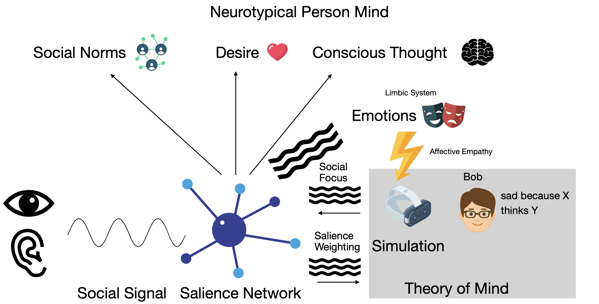

This describes the typical NT experience of [Theory of Mind](Theory%20of%20Mind.md).

**Note**: I do not experience this and have only secondhand knowledge and information gleaned from LLMs.

See also: [Autism Experience](Autism%20Experience.md) and [My Experience](My%20Experience.md).

## How It Works

{: style="max-width: 700px"}

- The various senses provide the "social signal" to the [salience network](Social%20Salience.md)
	- These are the nonverbal cues that people give off about what they are thinking and feeling
	- A variety of signals
		- Phatic expressions (how's it going?) -- pings
		- Prosody (tone)
		- Gaze direction
		- Facial micro expressions
		- Social proximity
		- And probably others
- The salience network is always on, fully automatic, low or zero effort
	- Low effort meaning: seamless integration, not low quality
	- The salience network's entire job is filtering out what is not important (noise and distractions -- see [Hearing](Hearing.md)) and assigning importance (salience) to what it passes through
	- This feeds the limbic system (emotions) with Social Focus
	- This feeds [Theory of Mind](Theory%20of%20Mind.md) with the Salience Weighting (the decoded signal)
	- The salience network is what causes people to value social interaction
	- In some cases the salience network can bypass conscious thought: gut feelings or intuition is a real thing
- The limbic system is the emotional core and it causes people to feel emotions that they sense
	- NT people *feel* other people's emotions -- affective [Empathy](../Emotions/Empathy.md) and "emotional contagion"
	- This feeds into the Theory of Mind to allow NT people to understand other people's emotions
- Theory of Mind is a group of systems in the brain
	- These simulate other people in the room and that the person knows
	- NT people don't think "Bob is sad" they *know* "Bob is sad because X"
	- Bidirectional – signal back nonverbally as well
		- Meaning exists between people, not just words.  Full of emotion and it is shared
		- Called: mirroring
	- Ambiguity is normal and fine
	- Not perfect
		- Subject to bias and belief of the person
		- May not be accurate
		- But is close enough and expected in NT people — maybe it works because it is continuous
	- Prioritize the _implied intent_ over the _literal word_
- NT people detect and predict the thoughts and emotions from people around them
	- What they know
	- What they believe
	- How they feel
	- Sense people as bundles of feelings
- What happens when an NT person encounters somebody who is not processing this way
	- Lack of emotional signaling (say [Flat Affect](Flat%20Affect.md)) or lack of mirroring
	- Automatic simulation mispredicts
	- The other person appears to be unpredictable or weird
## How It Feels

I am projecting based on what I have read.  This may sound a bit stilted -- I don't experience this and I am trying to contrast it to how autistic people and myself experience the world.

NT people feel connected to other people around them.  Their minds are built for social harmony and getting along.  They understand each other's feelings and thoughts and use this to reach consensus.  They use these signals to build shared trust and detect social threats, e.g. [antisocial personality disorder](Overlaps.md#ASPD).  For others, e.g. autistic people, they encounter the [Double Empathy](Double%20Empathy.md) problem and struggle with mis-prediction.

NT people behave the way they do because of social norms: [Shame](../Emotions/Shame.md) is a feeling that provides negative feedback if they behave antisocially and [Embarrassment](../Emotions/Embarrassment.md) does the same when they make social mistakes.  Social hierarchy is important.  It tells people who is the teller and who is the doer.  It gives weight to things that people say.

Social organizations exist to help people belong.  Humans are social creatures and they want to connect and belong to a community.
